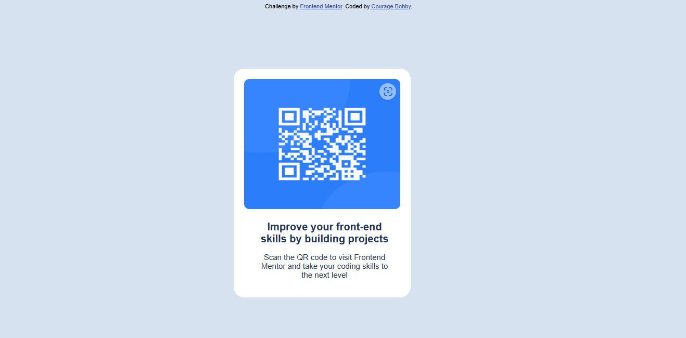

# Frontend Mentor - QR code component solution

This is a solution to the [QR code component challenge on Frontend Mentor](https://www.frontendmentor.io/challenges/qr-code-component-iux_sIO_H). Frontend Mentor challenges help you improve your coding skills by building realistic projects. 

## Table of contents

- [Overview](#overview)
  - [Screenshot](#screenshot)
  - [Links](#links)
- [My process](#my-process)
  - [Built with](#built-with)
  - [What I learned](#what-i-learned)
  - [Continued development](#continued-development)
  - [Useful resources](#useful-resources)
- [Author](#author)


## Overview

### Screenshot



### Links

- Solution URL: [Add solution URL here](https://your-solution-url.com)
- Live Site URL: [live URL ]( https://couragebobby1110.github.io/Beginner-projects/)

## My process

### Built with

- Semantic HTML5 markup
- CSS custom properties
- Flexbox
- Mobile-first workflow


### What I learned
 I learned how to use Flex-box Css3 properties to align divs and other block elements to ensure perfect centering


```html
  <div class="qrcodecontainer-content">

    
    <div class="qrcodecontainer-text">
      <h1>Improve your front-end <br>
      skills by building projects</h1>
      <p>Scan the QR code to visit Frontend <br>
      Mentor and take your coding skills to<br> the
       next level
      </p>
    </div>
```
```css
.qrcode-container {
  padding: 50px 40px 50px 40px;
}
```
```css
.qrcode-container{
  display: flex;
    justify-content: center;
    align-items: center;
    flex-direction: column;
    margin-top: 4rem;
     width: 900px
}
```


### Continued development

 I want to focus on how to use more flex-box properties because of how easy it is to align divs and block elements on a page. I intend on going over every useful resources on the internet until i am very confortable and perfect in that area.Another area that is of interest to me is css Grid and media queries which is super useful. 


### Useful resources

- [W3schools - css flexbox](https://www.w3schools.com/csS/css3_flexbox.asp) - This helped me understand the basic concept of flexbox . I really liked how direct and simple the explanation was.
- [W3schools -css media queries](https://www.w3schools.com/css/css3_mediaqueries.asp) - This is an amazing article which helped me finally understand media queries. I'd recommend it to anyone still learning this concept.


## Author

- Frontend Mentor - [@CourageBobby1110](https://www.frontendmentor.io/profile/@CourageBobby1110)
- instagram - [@hbird036](https://instagram.com/hbird036?igshid=ZDdkNTZiNTM=)
- twitter - [@ravensraven80](https://twitter.com/ravensraven80?t=WrLhdS7cqHXxtZhUqI5-JQ&s=08) 


